# 🐾 宠物交易/领养系统
# 源码获取：https://mbd.pub/o/bread/YZWcmJdrZg==

<p align="center">
  
  
  
  
  
  
</p>

<p align="center">
  <b>基于 SpringBoot + Vue 的全栈宠物交易与领养平台</b>
</p>

---

## 📋 目录

- [项目简介](#-项目简介)
- [功能特性](#-功能特性)
- [技术栈](#-技术栈)
- [系统架构](#-系统架构)
- [快速开始](#-快速开始)
- [项目截图](#-项目截图)
- [API接口](#-api接口)
- [数据库设计](#-数据库设计)
- [目录结构](#-目录结构)
- [贡献指南](#-贡献指南)
- [许可证](#-许可证)

---

## 🎯 项目简介

这是一个功能完善的宠物交易与领养系统，采用前后端分离架构开发。系统支持三种角色：**游客**、**普通用户**、**管理员**，提供宠物发布、交易、领养、在线沟通等核心功能。

### 核心亮点
- ✅ 完整的宠物交易流程（发布-浏览-下单-沟通）
- ✅ 实时在线聊天功能（WebSocket）
- ✅ 多角色权限管理
- ✅ 响应式前端设计
- ✅ 图片上传与管理

---

## ✨ 功能特性

### 🔓 游客功能
- 浏览宠物信息列表
- 查看宠物详情
- 搜索宠物

### 👤 普通用户功能
- **宠物管理**
  - 发布出售/领养宠物
  - 管理我的宠物
  - 上传宠物图片
- **交易功能**
  - 购买/收养宠物
  - 订单管理
  - 收货地址管理
- **沟通功能**
  - 与卖家/买家实时对话（WebSocket）
  - 消息通知
- **个人中心**
  - 个人信息修改
  - 密码修改
  - 实名认证

### 👑 管理员功能
- **用户管理**
  - 用户列表查看
  - 用户状态管理
- **宠物管理**
  - 宠物信息审核
  - 宠物分类管理（大分类/小分类）
- **订单管理**
  - 订单列表查看
  - 订单状态管理
- **系统管理**
  - 地址管理
  - 个人信息维护

---

## 🛠️ 技术栈

### 后端技术
| 技术 | 版本 | 说明 |
|------|------|------|
| Spring Boot | 2.2.4 | 核心框架 |
| MyBatis | 2.1.1 | ORM框架 |
| MySQL | 5.7+ | 数据库 |
| WebSocket | - | 实时通信 |
| Maven | 3.6+ | 构建工具 |
| Lombok | - | 代码简化 |
| Gson | 2.8.6 | JSON处理 |

### 前端技术
| 技术 | 版本 | 说明 |
|------|------|------|
| Vue.js | 2.6.14 | 前端框架 |
| Vue Router | 3.5.4 | 路由管理 |
| Vuex | 3.6.2 | 状态管理 |
| Element UI | 2.13.0 | UI组件库 |
| Axios | 0.19.2 | HTTP客户端 |

---

## 🏗️ 系统架构

```
┌─────────────────────────────────────────────────────────────┐
│                        前端层 (Vue.js)                       │
│  ┌──────────┬──────────┬──────────┬──────────┬──────────┐  │
│  │ 用户模块 │ 宠物模块 │ 订单模块 │ 聊天模块 │ 管理模块 │  │
│  └──────────┴──────────┴──────────┴──────────┴──────────┘  │
└─────────────────────────────────────────────────────────────┘
                              │
                              ▼
┌─────────────────────────────────────────────────────────────┐
│                      后端层 (SpringBoot)                     │
│  ┌──────────┬──────────┬──────────┬──────────┬──────────┐  │
│  │Controller│ Service  │   DAO    │ WebSocket│  Config  │  │
│  └──────────┴──────────┴──────────┴──────────┴──────────┘  │
└─────────────────────────────────────────────────────────────┘
                              │
                              ▼
┌─────────────────────────────────────────────────────────────┐
│                        数据层 (MySQL)                        │
│  ┌──────────┬──────────┬──────────┬──────────┬──────────┐  │
│  │ 用户表   │ 宠物表   │ 订单表   │ 消息表   │ 地址表   │  │
│  └──────────┴──────────┴──────────┴──────────┴──────────┘  │
└─────────────────────────────────────────────────────────────┘
```

---

## 🚀 快速开始

### 环境要求

| 项目 | 版本要求 |
|------|----------|
| JDK | 1.8+ |
| Maven | 3.6+ |
| MySQL | 5.7+ |
| Node.js | 14.0+ |
| npm | 6.0+ |

### 1. 克隆项目

```bash
git clone https://github.com/yourusername/pettrading.git
cd pettrading
```

### 2. 数据库配置

```bash
# 创建数据库
create database pet character set utf8mb4 collate utf8mb4_unicode_ci;

# 导入数据
mysql -u root -p pet < pet.sql
```

### 3. 后端启动

```bash
cd pet-trading

# 修改数据库配置（application.yml）
# 修改为你的数据库用户名和密码

# 编译运行
mvn clean install
mvn spring-boot:run
```

后端服务将在 `http://localhost:8081` 启动

### 4. 前端启动

```bash
cd pettrading

# 安装依赖
npm install

# 开发模式运行
npm run serve

# 生产构建
npm run build
```

前端服务将在 `http://localhost:8080` 启动

### 5. 访问系统

- 前端地址：http://localhost:8080
- 后端API：http://localhost:8081

---

## 📸 项目截图

### 首页
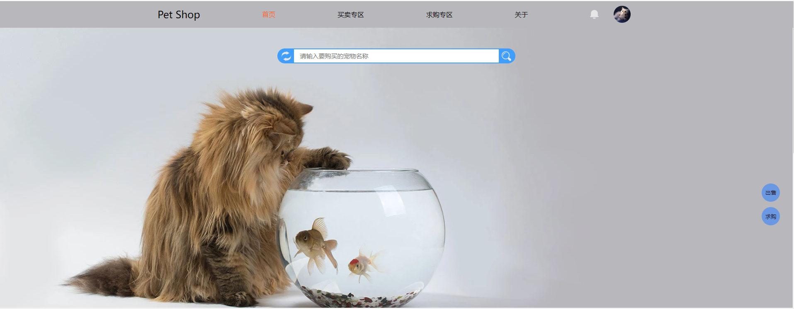

### 宠物列表
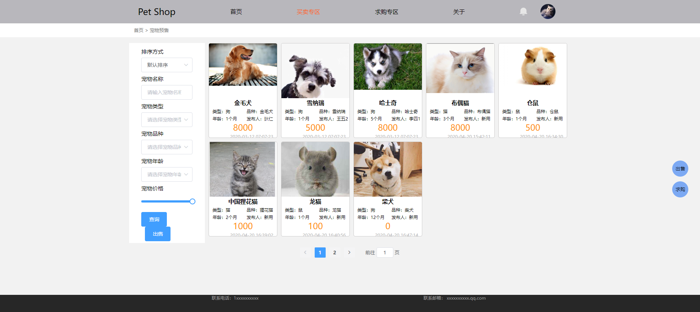

### 宠物详情
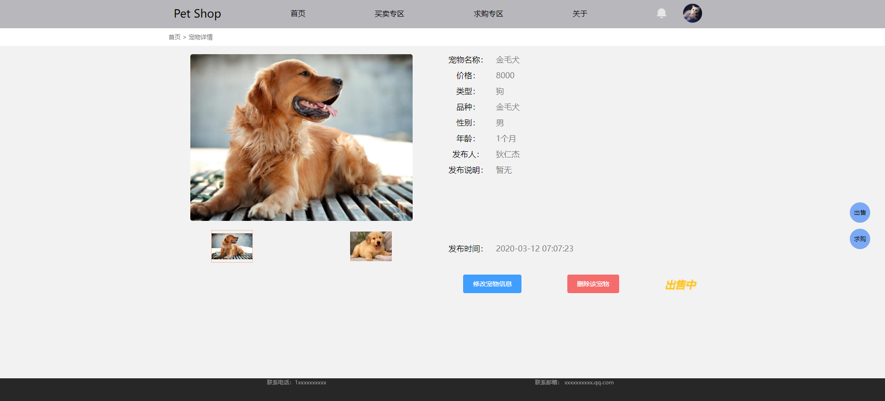

### 用户登录/注册
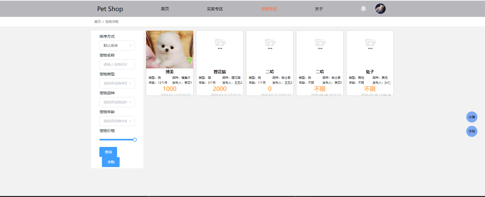

### 发布宠物
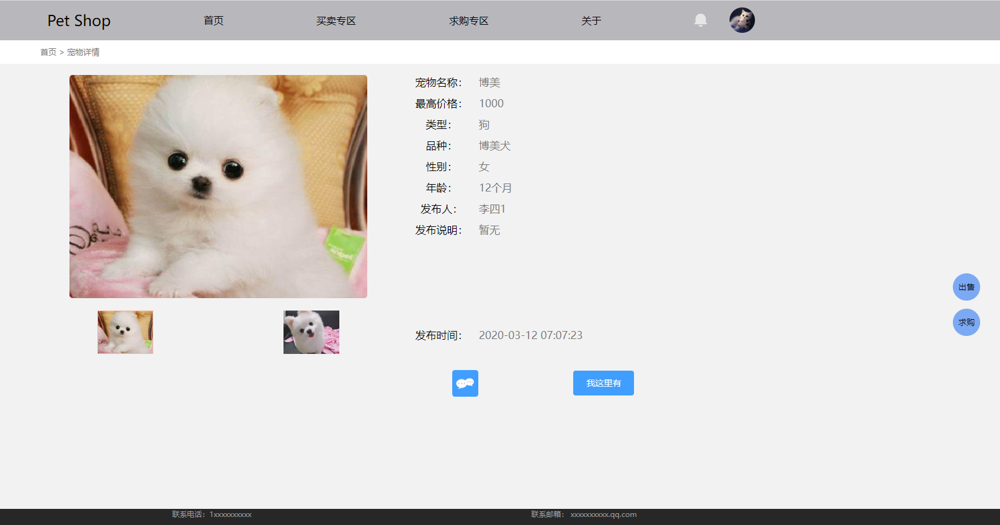

### 购物车/下单
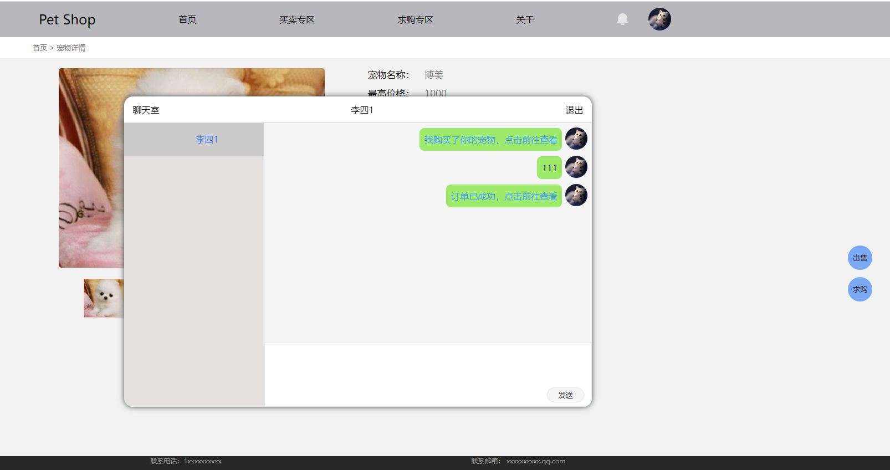

### 个人中心
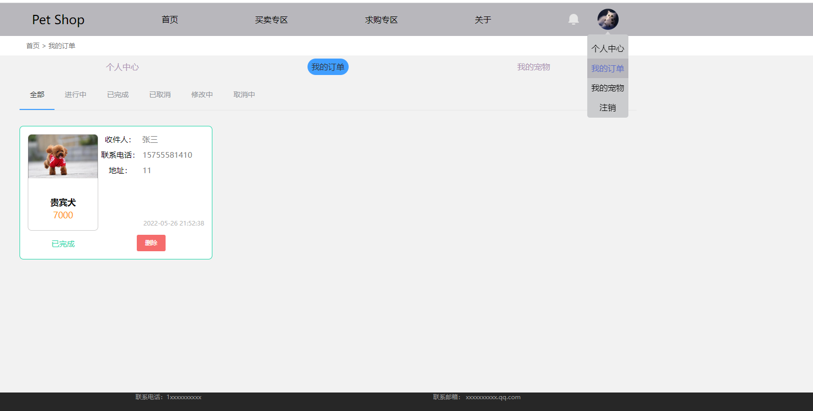

### 消息通知
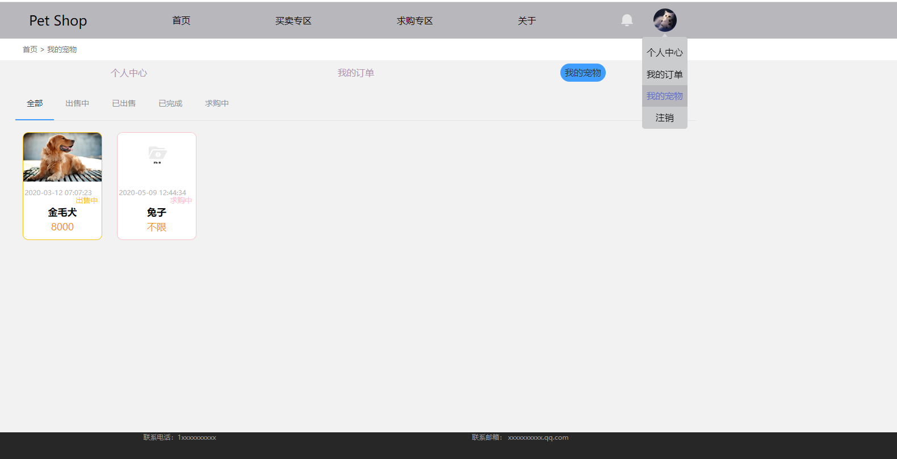

### 在线聊天
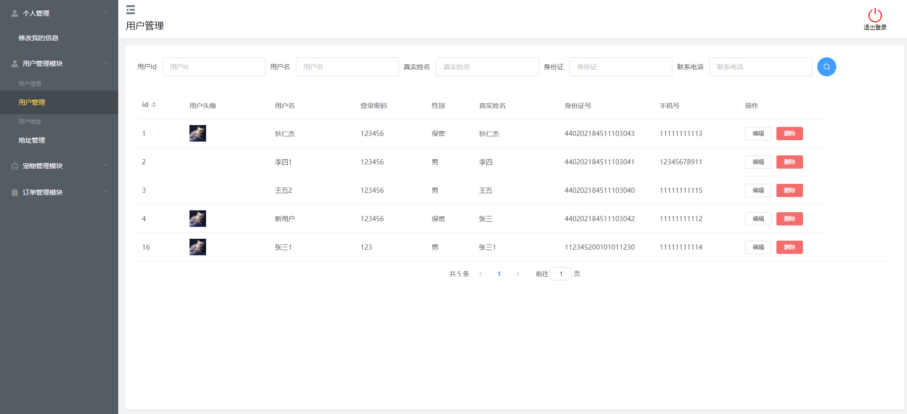

### 后台管理
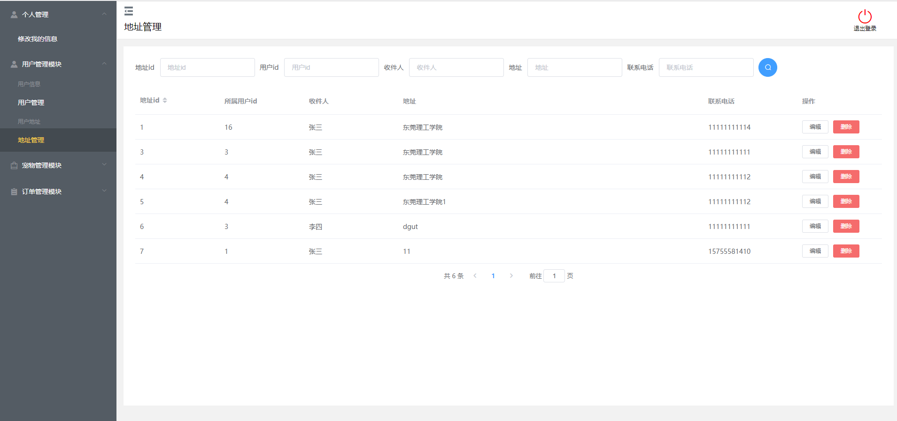

### 订单管理
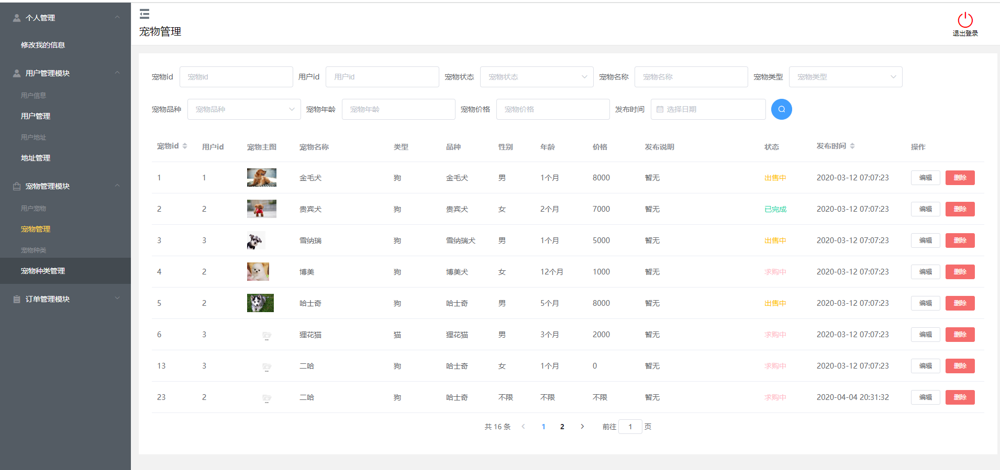

### 用户管理
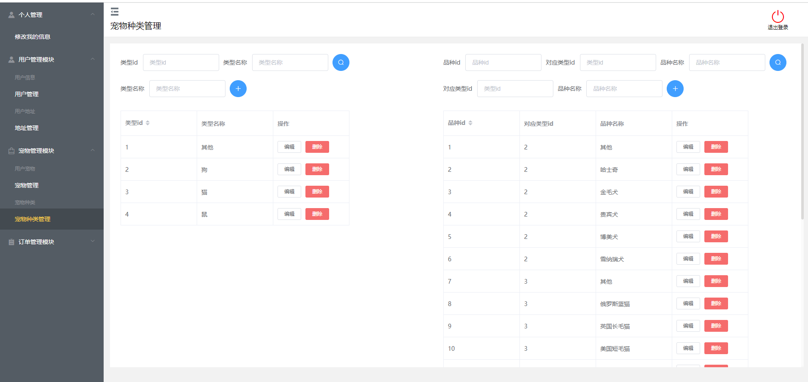

### 宠物管理
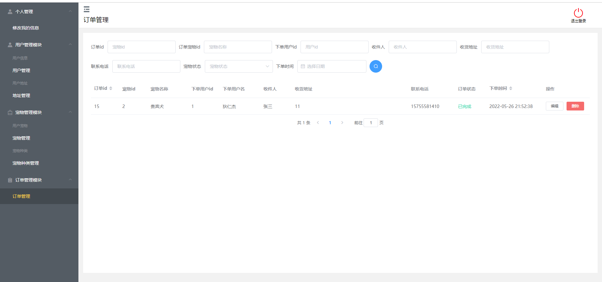

---

## 🔌 API接口

### 用户相关
| 接口 | 方法 | 说明 |
|------|------|------|
| /user/register | POST | 用户注册 |
| /user/login | POST | 用户登录 |
| /user/info | GET | 获取用户信息 |
| /user/update | PUT | 更新用户信息 |

### 宠物相关
| 接口 | 方法 | 说明 |
|------|------|------|
| /pet/list | GET | 获取宠物列表 |
| /pet/detail/{id} | GET | 获取宠物详情 |
| /pet/add | POST | 发布宠物 |
| /pet/update | PUT | 更新宠物信息 |
| /pet/delete/{id} | DELETE | 删除宠物 |

### 订单相关
| 接口 | 方法 | 说明 |
|------|------|------|
| /order/list | GET | 获取订单列表 |
| /order/add | POST | 创建订单 |
| /order/update | PUT | 更新订单状态 |

### WebSocket
| 端点 | 说明 |
|------|------|
| /websocket/notice | 消息通知 |
| /websocket/chat | 实时聊天 |

---

## 🗄️ 数据库设计

### 核心表结构

```sql
-- 用户表
CREATE TABLE user (
    id INT PRIMARY KEY AUTO_INCREMENT,
    username VARCHAR(50) NOT NULL,
    password VARCHAR(100) NOT NULL,
    phone VARCHAR(20),
    email VARCHAR(50),
    avatar VARCHAR(255),
    role INT DEFAULT 0, -- 0:普通用户 1:管理员
    status INT DEFAULT 1,
    create_time DATETIME DEFAULT CURRENT_TIMESTAMP
);

-- 宠物表
CREATE TABLE pet (
    id INT PRIMARY KEY AUTO_INCREMENT,
    name VARCHAR(100) NOT NULL,
    description TEXT,
    price DECIMAL(10,2),
    category_id INT,
    user_id INT,
    status INT DEFAULT 0, -- 0:待售 1:已售
    create_time DATETIME DEFAULT CURRENT_TIMESTAMP
);

-- 订单表
CREATE TABLE petorder (
    id INT PRIMARY KEY AUTO_INCREMENT,
    pet_id INT,
    buyer_id INT,
    seller_id INT,
    address_id INT,
    status INT DEFAULT 0,
    create_time DATETIME DEFAULT CURRENT_TIMESTAMP
);
```

完整数据库结构请查看 [pet.sql](./pet.sql)

---

## 📁 目录结构

```
pettrading-main/
├── pet-trading/                 # 后端项目
│   ├── src/main/java/com/example/
│   │   ├── config/             # 配置类
│   │   ├── controller/         # 控制器
│   │   ├── dao/                # 数据访问层
│   │   ├── domain/             # 实体类
│   │   ├── service/            # 服务层
│   │   └── helper/             # 工具类
│   ├── src/main/resources/
│   │   ├── application.yml     # 配置文件
│   │   └── com/example/dao/    # Mapper XML
│   └── pom.xml                 # Maven配置
│
├── pettrading/                  # 前端项目
│   ├── src/
│   │   ├── assets/             # 静态资源
│   │   ├── components/         # 组件
│   │   ├── views/              # 页面视图
│   │   ├── network/            # 网络请求
│   │   ├── router/             # 路由配置
│   │   └── store/              # 状态管理
│   ├── public/
│   └── package.json            # npm配置
│
├── picture/                     # 项目截图
├── pet.sql                      # 数据库文件
└── README.md                    # 项目说明
```

